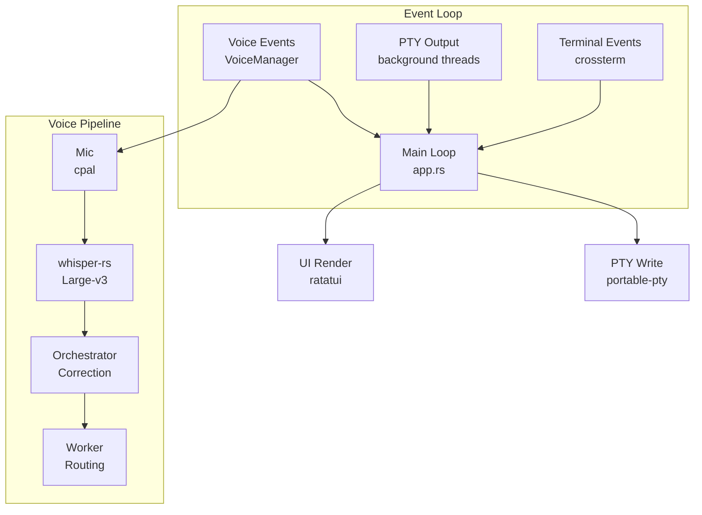

<div align="center">

<h1>CDC</h1>
<p><b>Orchestrate multiple Claude Code sessions from a single terminal.</b></p>

<p>
  <a href="#why"><strong>Why</strong></a> ·
  <a href="#features"><strong>Features</strong></a> ·
  <a href="#getting-started"><strong>Getting Started</strong></a> ·
  <a href="#usage"><strong>Usage</strong></a> ·
  <a href="#architecture"><strong>Architecture</strong></a>
</p>

<p>

[](https://www.rust-lang.org/)
[](LICENSE)
[](https://github.com/UnripePlum/claude-development-cli/stargazers)

</p>

</div>

<br />

```
┌──────────────────┬──────────────────┬──────────────────┐
│                  │                  │                  │
│  Worker 1        │  Worker 2        │  Worker 3        │  80%
│  claude          │  claude          │  claude          │
│                  │                  │                  │
├──────────────────┴──────────────────┴──────────────────┤
│                                                        │
│  Orchestrator                                     20%  │
│  claude                                                │
│                                                        │
└────────────────────────────────────────────────────────┘
```

<br />

## Why

AI-assisted development rarely fits in one terminal. You might want one Claude planning architecture while another writes tests, a third refactors a module, and a fourth handles docs — all on the same codebase at the same time.

CDC gives you a single terminal that acts as a control plane: one orchestrator coordinates N workers, voice commands route tasks hands-free, and smart alerts surface permission requests before they block progress.

## Features

<details open>
<summary><b>Multi-Session Orchestration</b></summary>

- Run one orchestrator + N independent worker panes
- Fuzzy directory picker with Tab completion when adding workers
- Mouse click or `Ctrl+1`–`9` to switch focus
- `Ctrl+Z` fullscreen toggle on any pane

</details>

<details open>
<summary><b>Full Terminal Emulation</b></summary>

- Complete VTE parser: SGR colors, cursor movement, scroll regions, alternate screen
- 10K-line scrollback buffer
- Korean/CJK wide-character and IME support
- 60 fps rendering via ratatui

</details>

<details>
<summary><b>Voice Input & Routing</b></summary>

- `Ctrl+R` toggles local microphone recording
- Transcribed by whisper-rs Large-v3 — no audio leaves the machine
- Speak "워커 1에게 테스트 작성해" to route commands to specific workers
- Orchestrator auto-corrects raw STT before dispatching

```
Mic → cpal → whisper-rs (Large-v3) → raw STT
  → Orchestrator: [CDC_CORRECT] corrected [/CDC_CORRECT]
  → parse_worker_route() → Worker N PTY
```

</details>

<details>
<summary><b>Session Management</b></summary>

- `Ctrl+S` saves layout and working directories to `~/.cdc/sessions/`
- `cdc --restore <name>` recreates the exact session
- Sessions stored as JSON, archivable

</details>

<details>
<summary><b>Smart Alerts</b></summary>

- Detects Claude permission prompts in any pane
- Pane border blinks red until resolved
- Voice state shown inline: `[REC]`, `[DL: 42%]`, `[STT...]`, `[CORRECTING...]`

</details>

## Getting Started

### Prerequisites

| Requirement | Install |
|-------------|---------|
| Rust (edition 2024) | [rustup.rs](https://rustup.rs/) |
| cmake | Required for whisper-rs C FFI |
| Claude Code CLI | `npm install -g @anthropic-ai/claude-code` |

> [!NOTE]
> On first voice use, the Whisper Large-v3 model (~2.9 GB) downloads automatically to `~/.cache/cdc/`.

### Build

```bash
git clone https://github.com/UnripePlum/claude-development-cli
cd claude-development-cli
cargo build --release
```

Optionally add to PATH:

```bash
cp target/release/cdc /usr/local/bin/
```

## Usage

```bash
cdc                          # start new session
cdc --restore my-project     # restore saved session
cdc --cwd ~/projects/repo    # start in specific directory
cdc --setup                  # check environment
```

### Keybindings

| Key | Action |
|-----|--------|
| `Ctrl+N` | Add worker |
| `Ctrl+W` | Close worker |
| `Ctrl+O` | Focus orchestrator |
| `Ctrl+1`–`9` | Focus worker N |
| `Ctrl+Z` | Fullscreen toggle |
| `Ctrl+S` | Save session |
| `Ctrl+R` | Voice recording toggle |
| `Ctrl+Q` | Quit |

### Environment Variables

| Variable | Default | Description |
|----------|---------|-------------|
| `CDC_CMD` | `claude` | Command spawned in each pane |
| `CDC_CORRECTION_TIMEOUT_MS` | `5000` | Voice correction hard ceiling |
| `CDC_CORRECTION_QUIESCENCE_MS` | `500` | Output idle threshold |
| `CDC_VOICE_LOG` | — | STT debug log path |
| `CDC_PTY_LOG` | — | Raw PTY byte log |

## Architecture



### Source Layout

```
src/
├── main.rs           # CLI entry, logo, setup wizard
├── app.rs            # Event loop, voice correction state machine
├── session.rs        # JSON session save/load/archive
├── event.rs          # ANSI key + SGR mouse encoding
├── pane/
│   ├── mod.rs        # Pane: grid + vte parser
│   └── grid.rs       # TerminalGrid: full VTE emulator
├── pty/
│   ├── mod.rs        # PtyManager: spawn/write/resize/kill
│   └── reader.rs     # Background PTY reader thread
├── ui/
│   ├── mod.rs        # Layout, render, dialogs, alerts
│   └── pane_widget.rs # ratatui Widget for TerminalGrid
└── voice/
    ├── mod.rs        # VoiceManager state machine
    ├── recorder.rs   # cpal audio capture
    └── transcriber.rs # whisper-rs STT + model download
```

## Tech Stack

| Layer | Crate | Version |
|-------|-------|---------|
| TUI | [ratatui](https://ratatui.rs) | 0.29 |
| Terminal I/O | [crossterm](https://github.com/crossterm-rs/crossterm) | 0.28 |
| PTY | [portable-pty](https://docs.rs/portable-pty) | 0.8 |
| VTE parser | [vte](https://docs.rs/vte) | 0.13 |
| Channels | [crossbeam-channel](https://docs.rs/crossbeam-channel) | 0.5 |
| CLI | [clap](https://clap.rs) | 4 |
| Audio | [cpal](https://docs.rs/cpal) | 0.17 |
| STT | [whisper-rs](https://github.com/tazz4843/whisper-rs) | 0.16 |
| HTTP | [ureq](https://docs.rs/ureq) | 2 |
| Serialization | [serde](https://serde.rs) + serde_json | 1 |

## Roadmap

- [x] Single PTY + VTE parser
- [x] Multi-worker layout (orchestrator + N workers)
- [x] Sessions, scrollback, dialogs, DECAWM
- [x] Voice input with whisper-rs + worker routing
- [x] SelfCorrector (orchestrator-based STT correction)
- [ ] PromptCorrector (prompt quality improvement before dispatch)

<!-- TODO: Add screenshot/GIF of CDC in action -->

## License

[MIT](LICENSE)
