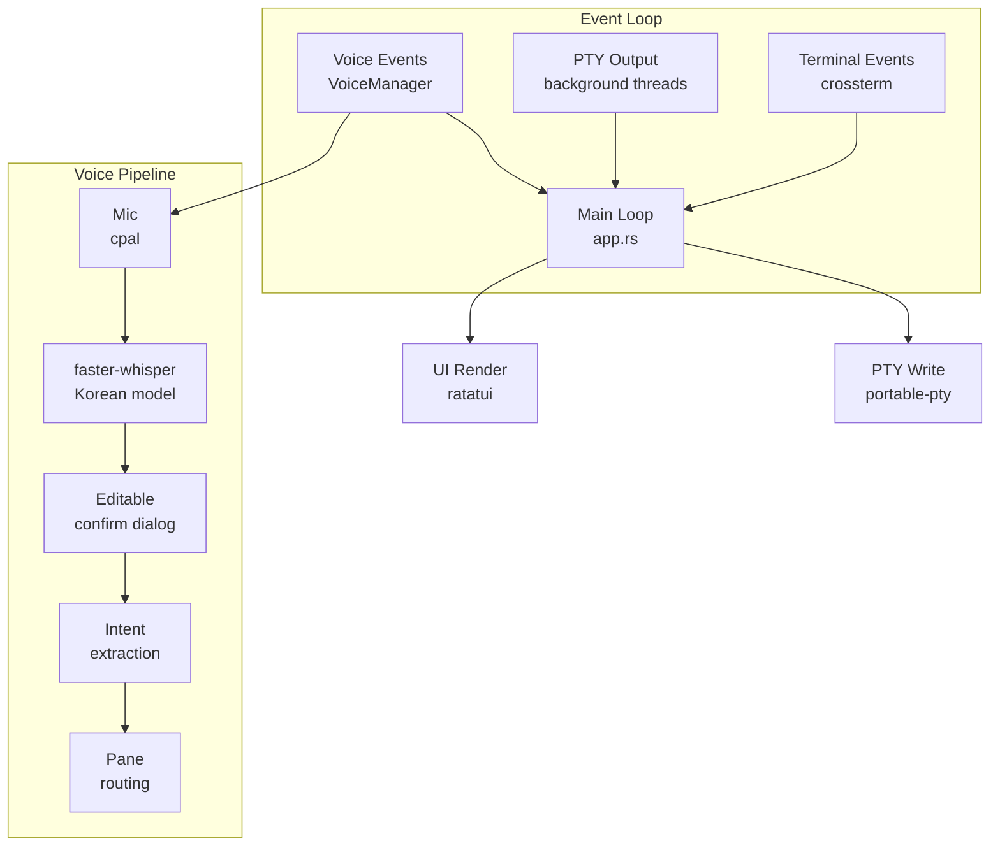

<div align="center">

<h1>CDC</h1>
<p><b>Orchestrate multiple Claude Code sessions from a single terminal.</b></p>

<p>
  <a href="#why"><strong>Why</strong></a> ·
  <a href="#features"><strong>Features</strong></a> ·
  <a href="#getting-started"><strong>Getting Started</strong></a> ·
  <a href="#usage"><strong>Usage</strong></a> ·
  <a href="#architecture"><strong>Architecture</strong></a>
</p>

<p>

[](https://www.rust-lang.org/)
[](LICENSE)
[](https://github.com/UnripePlum/claude-development-cli/stargazers)

</p>

</div>

<br />

```
┌──────────────────┬──────────────────┬──────────────[X]─┐
│                  │                  │                   │
│  Pane 1          │  Pane 2          │  Pane 3           │  80%
│  claude          │  claude          │  /bin/zsh         │
│                  │                  │                   │
├──────────────────┴──────────────────┴───────────────────┤
│                                                         │
│  Orchestrator — Ctrl+R: voice                      20%  │
│  claude                                                 │
│                                                         │
└─────────────────────────────────────────────────────────┘
```

<br />

## Why

AI-assisted development rarely fits in one terminal. You might want one Claude planning architecture while another writes tests, a third refactors a module, and a plain shell runs builds — all on the same codebase at the same time.

CDC gives you a single terminal that acts as a control plane: one orchestrator coordinates N panes, voice commands route tasks hands-free, and smart alerts surface permission requests before they block progress.

## Features

<details open>
<summary><b>Multi-pane orchestration</b></summary>

- One orchestrator + N independent panes (Claude Code or plain terminal)
- 3-step pane creation: directory picker → Claude/Terminal mode → permission mode
- Fuzzy directory search with VS Code-style ↑↓/Tab picker
- Mouse click or `Ctrl+1`–`9` to switch focus
- `Ctrl+Z` fullscreen toggle, `[X]` close button on each pane
- Mouse drag text selection with clipboard copy

</details>

<details open>
<summary><b>Full terminal emulation</b></summary>

- Complete VTE parser: SGR colors, cursor movement, scroll regions, DECAWM, alternate screen save/restore
- 10K-line scrollback buffer
- Korean/CJK wide-character and IME support
- 60 fps rendering via ratatui

</details>

<details>
<summary><b>Voice input and routing</b></summary>

- `Ctrl+R` toggles local microphone recording
- Transcribed by faster-whisper (ghost613/faster-whisper-large-v3-turbo-korean) — no audio leaves the machine
- Editable confirmation dialog before execution — fix STT errors, then Enter to send
- Speak "페인 1에게 테스트 작성해" to route commands to specific panes
- Correction detection: "아니 그거 말고 빌드해" extracts only the final intent
- Voice CDC commands: "새 페인 만들어" opens the pane creation dialog

```
Mic → cpal → faster-whisper (Korean) → editable confirm dialog
  → extract_last_intent() → parse_worker_route() → Pane N PTY
```

</details>

<details>
<summary><b>Session management</b></summary>

- `Ctrl+S` saves layout and working directories to `~/.cdc/sessions/`
- `cdc --restore <name>` recreates the exact session
- Sessions stored as JSON, archivable

</details>

<details>
<summary><b>Smart alerts</b></summary>

- Detects Claude permission prompts in any pane
- Pane border blinks red until resolved
- Voice state shown inline: `[REC] Ctrl+R: stop`, `[STT...]`
- Interactive confirm dialogs with mouse click and ↑↓/Enter

</details>

## Getting started

### Prerequisites

| Requirement | Install |
|-------------|---------|
| Rust (edition 2024) | [rustup.rs](https://rustup.rs/) |
| Claude Code CLI | `npm install -g @anthropic-ai/claude-code` |

### Build

```bash
git clone https://github.com/UnripePlum/claude-development-cli
cd claude-development-cli
cargo build --release
```

### Voice setup (optional)

```bash
python3 -m venv .venv
source .venv/bin/activate
pip install faster-whisper
```

The Korean STT model (~2 GB) downloads automatically on first `Ctrl+R` use.

## Usage

```bash
./target/release/cdc                  # start new session
./target/release/cdc --restore proj   # restore saved session
./target/release/cdc --cwd ~/repo     # start in specific directory
./target/release/cdc --setup          # check environment
```

### Keybindings

| Key | Action |
|-----|--------|
| `Ctrl+N` | Add pane (3-step: directory → Claude/Terminal → permissions) |
| `Ctrl+W` | Close focused pane |
| `Ctrl+O` | Focus orchestrator |
| `Ctrl+1`–`9` | Focus pane N |
| `Ctrl+Z` | Fullscreen toggle |
| `Ctrl+S` | Save session |
| `Ctrl+R` | Voice recording toggle |
| `Ctrl+Q` | Quit |
| `Shift+PgUp/Down` | Scrollback |

### Environment variables

| Variable | Default | Description |
|----------|---------|-------------|
| `CDC_CMD` | `claude` | Command spawned in Claude panes |
| `CDC_VOICE_LOG` | — | STT debug log path |
| `CDC_PTY_LOG` | — | Raw PTY byte log |

## Architecture



### Source layout

```
src/
├── main.rs           # CLI entry, logo, setup wizard
├── app.rs            # Event loop, intent extraction, pane routing
├── session.rs        # JSON session save/load/archive
├── event.rs          # ANSI key + SGR mouse encoding
├── pane/
│   ├── mod.rs        # Pane: grid + vte parser
│   └── grid.rs       # TerminalGrid: full VTE emulator
├── pty/
│   ├── mod.rs        # PtyManager: spawn/write/resize/kill
│   └── reader.rs     # Background PTY reader thread
├── ui/
│   ├── mod.rs        # Layout, render, dialogs, alerts
│   └── pane_widget.rs # ratatui Widget for TerminalGrid
└── voice/
    ├── mod.rs        # VoiceManager state machine
    ├── recorder.rs   # cpal audio capture + 16kHz resampling
    └── transcriber.rs # faster-whisper Python subprocess
scripts/
└── stt.py            # faster-whisper STT backend
```

## Tech stack

| Layer | Crate/Tool | Version |
|-------|------------|---------|
| TUI | [ratatui](https://ratatui.rs) | 0.29 |
| Terminal I/O | [crossterm](https://github.com/crossterm-rs/crossterm) | 0.28 |
| PTY | [portable-pty](https://docs.rs/portable-pty) | 0.8 |
| VTE parser | [vte](https://docs.rs/vte) | 0.13 |
| Channels | [crossbeam-channel](https://docs.rs/crossbeam-channel) | 0.5 |
| CLI | [clap](https://clap.rs) | 4 |
| Audio | [cpal](https://docs.rs/cpal) | 0.17 |
| STT | [faster-whisper](https://github.com/SYSTRAN/faster-whisper) | Python |
| Serialization | [serde](https://serde.rs) + serde_json | 1 |

## Roadmap

- [x] Single PTY + VTE parser
- [x] Multi-pane layout (orchestrator + N panes)
- [x] Sessions, scrollback, DECAWM, alt screen save/restore
- [x] Voice input with faster-whisper + pane routing
- [x] Editable STT confirmation dialog
- [x] Intent correction ("아니 그거 말고" detection)
- [x] Voice CDC commands ("새 페인 만들어")
- [x] Mouse drag text selection + clipboard
- [x] 3-step pane creation (Claude/Terminal + permissions)
- [x] Interactive dialogs (mouse click + keyboard)
- [x] [X] close button on panes
- [ ] Pane drag resize
- [ ] Custom pane names

## License

[MIT](LICENSE)
